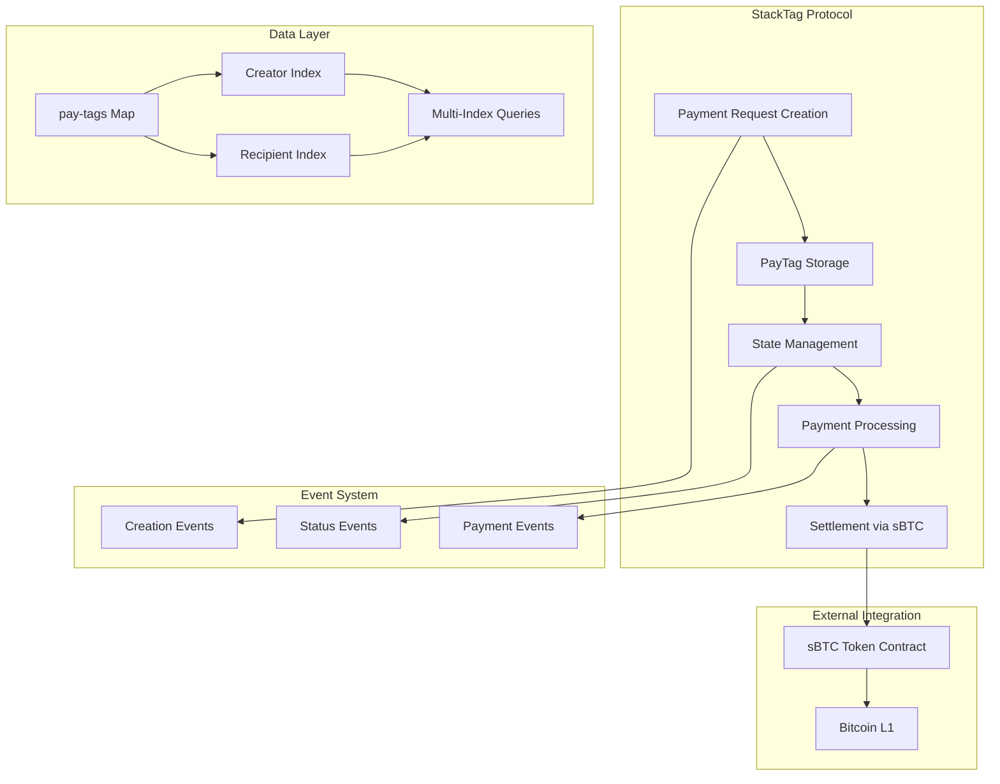

# StackTag - Decentralized Payment Request Protocol

[](https://bitcoin.org)
[](https://stacks.co)
[](https://sbtc.tech)

## Overview

StackTag is a revolutionary Bitcoin Layer 2 payment request system that enables seamless, trustless invoice creation and settlement using sBTC on the Stacks blockchain. It transforms how payments are requested and processed in the Bitcoin ecosystem by providing a secure, programmable, and decentralized payment infrastructure.

### Key Benefits

- **🔒 Bitcoin-Grade Security**: Leverages Stacks' proof-of-transfer consensus mechanism
- **⚡ Instant Settlements**: Native sBTC integration for fast Bitcoin transactions
- **🌐 Decentralized**: No intermediaries or centralized payment processors
- **📊 Comprehensive Tracking**: Full payment history and status monitoring
- **⏰ Time-Bound Requests**: Automatic expiration handling with configurable timeouts
- **💼 Enterprise Ready**: Perfect for merchants, freelancers, and businesses

## Architecture



### Core Components

#### 1. PayTag Structure

Each payment request (PayTag) contains:

- **Creator**: The principal who created the request
- **Recipient**: The principal who will receive the payment
- **Amount**: Payment amount in sBTC units
- **Timestamps**: Creation and expiration block heights
- **State**: Current status (pending/paid/expired/canceled)
- **Memo**: Optional descriptive text
- **Payment Transaction**: Reference to settlement transaction

#### 2. State Management

PayTags transition through four distinct states:

- `PENDING`: Awaiting payment
- `PAID`: Successfully fulfilled
- `EXPIRED`: Past expiration time
- `CANCELED`: Canceled by creator

#### 3. Indexing System

Efficient data retrieval through multiple indexes:

- Creator-based indexing for request management
- Recipient-based indexing for payment tracking
- Direct ID-based lookup for specific requests

## Features

### Core Functionality

- **Decentralized Invoice Creation**: Create payment requests without intermediaries
- **Automatic Expiration**: Configurable timeouts with maximum 30-day limit
- **sBTC Integration**: Direct Bitcoin settlement through Stacks Layer 2
- **Payment Tracking**: Comprehensive history and status monitoring
- **Creator Controls**: Cancel pending requests at any time
- **Batch Operations**: Retrieve multiple PayTags efficiently
- **Event-Driven Updates**: Real-time notifications for state changes

### Security Features

- **Access Control**: Only creators can cancel their requests
- **Expiration Validation**: Automatic expiry prevention of stale requests
- **Amount Validation**: Ensures positive payment amounts
- **State Consistency**: Prevents invalid state transitions
- **Overflow Protection**: Safe arithmetic operations

## Quick Start

### Prerequisites

- Stacks wallet with sBTC balance
- Access to Stacks blockchain (testnet or mainnet)
- Understanding of Clarity smart contracts

### Creating a Payment Request

```clarity
;; Create a PayTag for 1000 sBTC units, expiring in 1440 blocks (~10 days)
(contract-call? .stacktag create-pay-tag u1000 u1440 (some "Invoice #001 - Web Development"))
```

### Fulfilling a Payment Request

```clarity
;; Pay PayTag with ID 1
(contract-call? .stacktag fulfill-pay-tag u1)
```

### Querying Payment Requests

```clarity
;; Get details of PayTag ID 1
(contract-call? .stacktag get-pay-tag u1)

;; Get all PayTags created by a principal
(contract-call? .stacktag get-creator-tags 'ST1HTBVD3JG9C05J7HBJTHGR0GGW7KXW28M5JS8QE)

;; Get all PayTags where principal is recipient
(contract-call? .stacktag get-recipient-tags 'ST1HTBVD3JG9C05J7HBJTHGR0GGW7KXW28M5JS8QE)
```

## API Reference

### Public Functions

#### `create-pay-tag`

Creates a new payment request.

**Parameters:**

- `amount` (uint): Payment amount in sBTC units
- `expires-in` (uint): Expiration time in blocks from creation
- `memo` (optional string-ascii 256): Descriptive text

**Returns:** `(response uint uint)` - PayTag ID or error code

#### `fulfill-pay-tag`

Fulfills a payment request by transferring sBTC.

**Parameters:**

- `id` (uint): PayTag identifier

**Returns:** `(response uint uint)` - PayTag ID or error code

#### `cancel-pay-tag`

Cancels a pending payment request (creator only).

**Parameters:**

- `id` (uint): PayTag identifier

**Returns:** `(response uint uint)` - PayTag ID or error code

#### `mark-expired`

Marks an expired PayTag as expired (callable by anyone).

**Parameters:**

- `id` (uint): PayTag identifier

**Returns:** `(response uint uint)` - PayTag ID or error code

### Read-Only Functions

#### `get-pay-tag`

Retrieves details of a specific PayTag.

#### `get-creator-tags`

Lists all PayTag IDs created by a principal.

#### `get-recipient-tags`

Lists all PayTag IDs where a principal is the recipient.

#### `check-tag-expired`

Checks if a PayTag has expired but not been marked as such.

## Error Codes

| Code | Constant | Description |
|------|----------|-------------|
| 100 | ERR-TAG-EXISTS | PayTag already exists |
| 101 | ERR-NOT-PENDING | PayTag is not in pending state |
| 102 | ERR-INSUFFICIENT-FUNDS | Insufficient sBTC balance |
| 103 | ERR-NOT-FOUND | PayTag not found |
| 104 | ERR-UNAUTHORIZED | Operation not authorized |
| 105 | ERR-EXPIRED | PayTag has expired |
| 106 | ERR-INVALID-AMOUNT | Invalid payment amount |
| 107 | ERR-EMPTY-MEMO | Empty memo not allowed |
| 108 | ERR-MAX-EXPIRATION-EXCEEDED | Expiration exceeds maximum allowed |

## Events

StackTag emits the following events for external monitoring:

### pay-tag-created

```clarity
{
  event: "pay-tag-created",
  id: uint,
  creator: principal,
  amount: uint
}
```

### pay-tag-paid

```clarity
{
  event: "pay-tag-paid",
  id: uint,
  from: principal,
  to: principal,
  amount: uint,
  memo: (optional string-ascii 256)
}
```

### pay-tag-canceled

```clarity
{
  event: "pay-tag-canceled",
  id: uint,
  creator: principal
}
```

### pay-tag-expired

```clarity
{
  event: "pay-tag-expired",
  id: uint
}
```

## Use Cases

### E-commerce

- **Online Merchants**: Create payment requests for orders
- **Subscription Services**: Recurring payment management
- **Digital Products**: Instant settlement for downloads

### Freelancing

- **Invoice Management**: Professional payment requests
- **Milestone Payments**: Project-based settlements
- **Client Relations**: Transparent payment tracking

### B2B Transactions

- **Supply Chain**: Vendor payment coordination
- **Professional Services**: Consulting and service payments
- **Cross-border**: International business settlements

## Integration Examples

### Frontend Integration

```javascript
// Example using Stacks.js
import { openContractCall } from '@stacks/connect';

const createPaymentRequest = async (amount, expiresIn, memo) => {
  const functionArgs = [
    uintCV(amount),
    uintCV(expiresIn),
    someCV(stringAsciiCV(memo))
  ];

  await openContractCall({
    network,
    contractAddress: 'ST1F7QA2MDF17S807EPA36TSS8AMEFY4KA9TVGWXT',
    contractName: 'stacktag',
    functionName: 'create-pay-tag',
    functionArgs,
    onFinish: (data) => {
      console.log('PayTag created:', data);
    }
  });
};
```

### Backend Monitoring

```javascript
// Monitor PayTag events
const monitorPayTags = async () => {
  const events = await getContractEvents({
    contractId: 'ST1F7QA2MDF17S807EPA36TSS8AMEFY4KA9TVGWXT.stacktag',
    limit: 50
  });

  events.results.forEach(event => {
    if (event.contract_log?.value?.event === 'pay-tag-paid') {
      // Handle payment confirmation
      processPayment(event);
    }
  });
};
```

## Development

### Building

```bash
# Install Clarinet
npm install -g @hirosystems/clarinet-cli

# Test the contract
clarinet test

# Deploy to testnet
clarinet deploy --testnet
```

### Testing

```bash
# Run unit tests
clarinet test --coverage

# Run integration tests
clarinet integrate
```

## Deployment

### Testnet

```bash
clarinet deploy --testnet --key-file=./keys/testnet.json
```

### Mainnet

```bash
clarinet deploy --mainnet --key-file=./keys/mainnet.json
```

## Security Considerations

- **sBTC Balance**: Ensure sufficient balance before fulfilling PayTags
- **Expiration Timing**: Set appropriate expiration windows
- **State Validation**: Always check PayTag state before operations
- **Access Control**: Only creators can cancel their PayTags
- **Amount Limits**: Consider implementing additional amount validations

## Contributing

We welcome contributions! Please see our [Contributing Guidelines](CONTRIBUTING.md) for details.

### Development Process

1. Fork the repository
2. Create a feature branch
3. Write tests for new functionality
4. Ensure all tests pass
5. Submit a pull request

## Roadmap

- [ ] Multi-signature PayTag support
- [ ] Recurring payment templates
- [ ] Payment splitting functionality
- [ ] Enhanced memo system with rich content
- [ ] Integration with popular accounting software
- [ ] Mobile SDK development
- [ ] Advanced analytics dashboard

## License

This project is licensed under the MIT License - see the [LICENSE](LICENSE) file for details.

## Acknowledgments

- Stacks Foundation for the blockchain infrastructure
- sBTC team for the Bitcoin Layer 2 solution
- Bitcoin Core developers for the foundational protocol
- The broader Bitcoin and Stacks communities

---

**StackTag** - Revolutionizing Bitcoin payments, one tag at a time.
